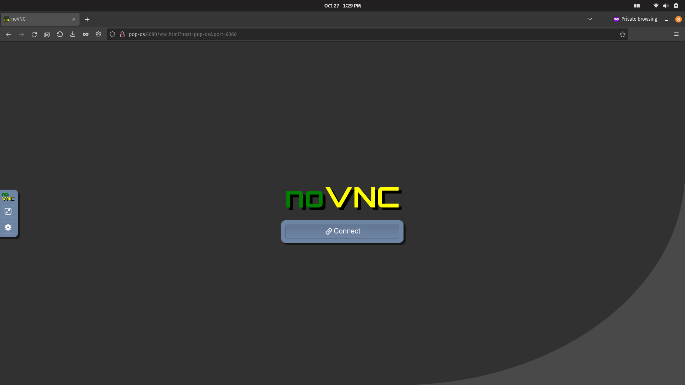
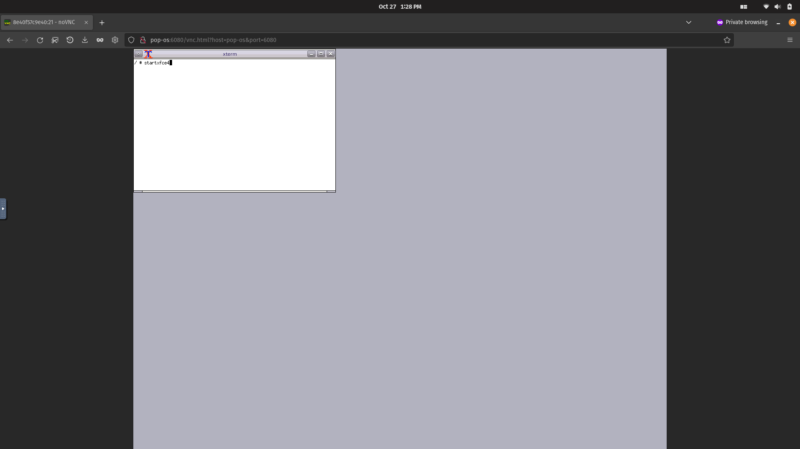
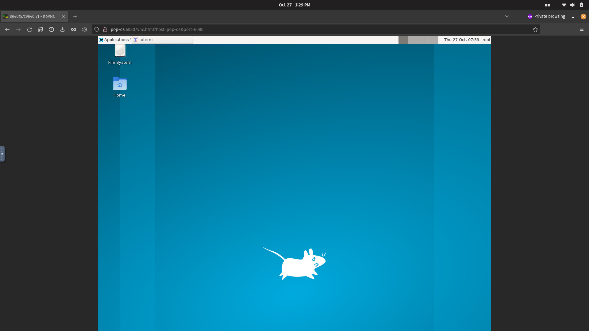

# **Implementing GUI for linux Docker containers**  

Dockerfile uploaded for setting up the container  

**Build docker file**  

`sudo docker build -t tag_name /Desktop/Dockerfile_folder`  

**Run following on a separate terminal, a black window will show**  

`xhost +local:*`  
`Xephyr :0`  

**Start the container**  

`sudo docker run -it -e DISPLAY=$DISPLAY -v /tmp/.X11-unix:/tmp/.X11-unix/ -v $HOME/.Xauthority:/.Xauthority --name my_container tag_name ` 

**Start and attach the container IF already created but closed, in order to do it again**  

`sudo docker start my_container`   
`sudo docker attach my_container`   

**In the container's shell, run the following**  
**if it says startxfce4 not found, run `apk add xfce4` in the shell**  

`DISPLAY=:0 startxfce4`  

**ctrl+c in container shell to close**  
**type exit in container shell to close it**  

**If there is an error, close and restart Xephyr and run line 23 again**  

## **_USING x11vnc_**  
_update: added 'apk add fluxbox xvfb xterm' to Dockerfile_  
_Connect remotely to another device_  

Install vnc viewer in another device.  

**Use below command to create container instead**  
  `sudo docker run -it -p --net=host --name my_container tag_name`  

**Make sure the host machine allows 5900 in its firewall**  

In container, run:  
  `x11vnc -storepasswd`  
  `x11vnc -create -env FD_PROG=/usr/bin/fluxbox -shared -rfbauth /path/where/pass/was/stored/in/above/command/result`  
 
In the vnc viewer, enter ip address of your main system, not the container.  

In the device, right click + xterm.  
In the terminal, type:  
  `startxfce4`  

## **_USING novnc_**  
Connect to docker container through browser using novnc  

_update_:Added 'RUN apk add git', 'RUN apk add bash', and 'RUN apk add python3' in Dockerfile

Download [novnc](https://github.com/novnc/noVNC/releases)  

In container, run:  
    `x11vnc -storepasswd`  
    `x11vnc -create -env FD_PROG=/usr/bin/fluxbox -shared -rfbauth /path/where/pass/was/stored/in/above/command/result`  

In a new terminal of host system 
`cd /path/to/extracted/noVNC_folder`

Execute following in that terminal  

`./utils/novnc_proxy --vnc localhost:5900`  

Go to remote system's browser and enter the url given by above command's output  
Replace the host-name(e.g pop-os) with system's public IP address  
http://pop-os:6080/vnc.html?host=pop-os&port=6080  
Click connect  

  

  

  

