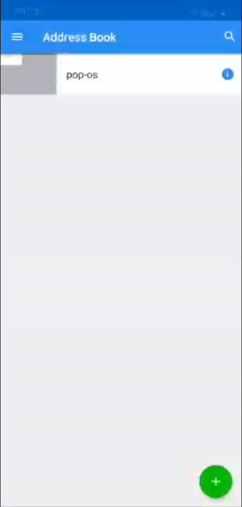
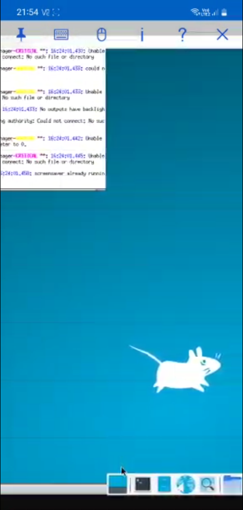

# **Implementing GUI for linux Docker containers**  

Dockerfile uploaded for setting up the container  

# Table of contents
1. [Dockerfile](#Build-docker-file-)
2. [USING Xephyr](#USING-Xephyr)
3. [USING x11vnc](#USING-x11vnc-)
4. [USING novnc](#USING-novnc-)
5. [Docker image for novnc implementation](#Docker-image-for-novnc-implementation-)

## **Build docker file**  

&emsp;`sudo docker build -t tag_name /Desktop/Dockerfile_folder`  

## **_USING Xephyr_**

**Run following on a separate terminal, a black window will show**  

&emsp;`xhost +local:*`  
&emsp;`Xephyr :0`  

**Start the container**  

&emsp;`sudo docker run -it -e DISPLAY=$DISPLAY -v /tmp/.X11-unix:/tmp/.X11-unix/ -v $HOME/.Xauthority:/.Xauthority --name my_container tag_name ` 

**Start and attach the container IF already created but closed, in order to do it again**  

&emsp;`sudo docker start my_container`   
&emsp;`sudo docker attach my_container`   

**In the container's shell, run the following**  

&emsp;`DISPLAY=:0 startxfce4`  

**ctrl+c in container shell to close**  
**type exit in container shell to close it**  

**If there is an error, close and restart Xephyr and run line 23 again**  

## **_USING x11vnc_**  
_update: added 'apk add xvfb' to Dockerfile_  
_Connect remotely to another device_  

Install vnc viewer in another device.  

**Use below command to create container instead**  
&emsp;`sudo docker run -it --net=host --name my_container tag_name`  

**Make sure the host machine allows 5900 in its firewall**  
&emsp;`sudo ufw enable`  
&emsp;`sudo ufw allow 5900`  

If the vnc viewer doesn't detect the system, reset the firewall, enable and allow 5900 again  
&emsp;`sudo ufw reset`  
&emsp;`sudo ufw enable`  
&emsp;`sudo ufw allow 5900`  

In container, run:  
&emsp;`x11vnc -storepasswd`  
&emsp;`x11vnc -create -env FD_PROG=/usr/bin/startxfce4 -shared -rfbauth /path/where/pass/was/stored/in/above/command/result`  
 

 
In the vnc viewer, enter ip address of your main system, not the container.  

## **_USING novnc_**  
Connect to docker container through browser using novnc  

_update_:Added 'RUN apk add git', 'RUN apk add bash', and 'RUN apk add python3' in Dockerfile

Download [novnc](https://github.com/novnc/noVNC/releases)  

**Use below command to create container instead**  
&emsp;`sudo docker run -it --net=host -v /path/of/novnc/folder:/path/for/novnc/folder --name my_container tag_name`  

In container, run:  
&emsp;`x11vnc -storepasswd`  
&emsp;`x11vnc -create -env FD_PROG=/usr/bin/startxfce4 -shared -rfbauth /path/where/pass/was/stored/in/above/command/result`  

Execute another terminal in container  

&emsp;`sudo docker exec -it my_container /bin/sh`  

Run following in this terminal  

&emsp;`./utils/novnc_proxy --vnc localhost:5900`  

Go to remote system's browser and enter the url given by above command's output  
Replace the host-name(e.g pop-os) with system's public IP address  
http://pop-os:6080/vnc.html?host=pop-os&port=6080  
Click connect  

  

  

## Docker image for novnc implementation:  

&emsp;`docker pull marsbeaver/gui_imp:latest`  

Create and run container:  

&emsp;`docker run -it -p 6080:6080 --name my_container marsbeaver/gui_imp:latest`

In the container's terminal, run:  

&emsp;`./usr/bin/abcd.sh`  

Enter below url in remote machine, replace pop-os with host system ip:  

http://pop-os:6080/vnc.html  

Click Connect.

